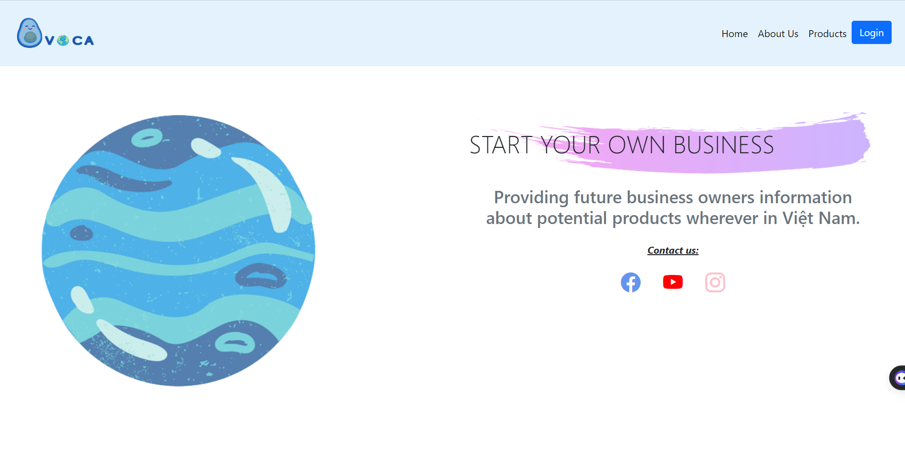
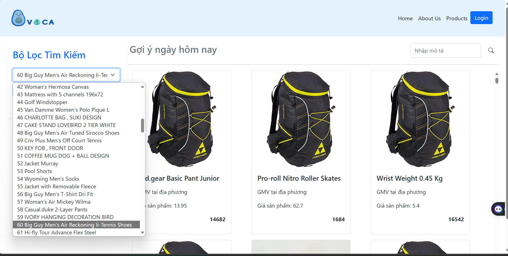
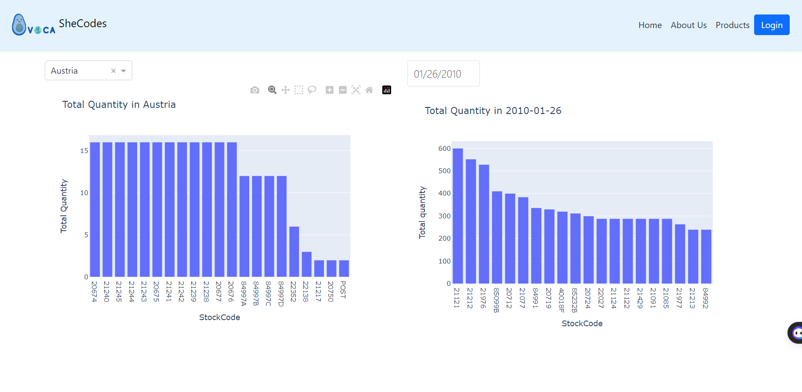
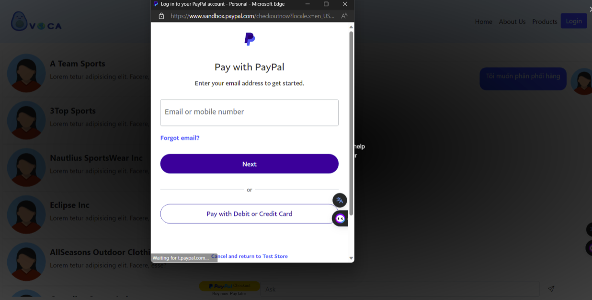

# AVOCA Website

HIAP - Giải pháp về kết nối nhượng quyền/phân phối thông minh cho doanh nghiệp.



## Features

- **Recommendation system**: Gợi ý sản phẩm phù hợp với người dùng sử dụng `KNN`, `cosine_similarity`, `MatrixFactorization` dựa vào sản phẩm đã bán hoặc dữ liệu thông tin người dùng cung cấp.

- **DashBoard**: Theo dõi tình hình kinh doanh của nhà phân phối theo `thời gian hiện tại` và `các nước.`

- **Private messaging system**: Request thêm hàng và trò chuyện giữa người dùng và nhà phân phối.

- **Payment management system**: Quản lý thanh toán dành cho đơn vị phân phối/nhượng quyền (thanh toán bằng PayPal)

- **Search system**: Tiềm kiếm sản phẩm theo tên, nhu cầu khách hàng.

- **User system**: Đăng kí, đăng nhập và quản lý tài khoản của người dùng.


| Recomendation System| DashBoard| Payment management system|
|---------------------------------------------------|---------------------------------------------------| ---------------------------------------------------|
|      |   |   

## Installation

### Clone the repository

```
$ git clone https://github.com/BLUE-AVOCA/Blue-avoca.git
```

### Set up enviroment 

```
$ cd env/scripts
```

```
activate or .\activate
```


### Change into the Website/Scraper directory:

```
$ cd..
$ cd.. 
$ cd Connected\flask_app
```


### Install the required dependencies using pip:

```
$ pip install -r requirements.txt
```

### Set up 

```
set FLASK_APP=app 
set FLASK_ENV=development
set FLASK_DEBUG=1
```

## Usage of Website

Update the information of your database.

Start the Flask development server:

```
$ flask run 
```
or

```
$ python -m flask run
```

In flask, default port is 5000.

Open your web browser and go to http://127.0.0.1:5000.


